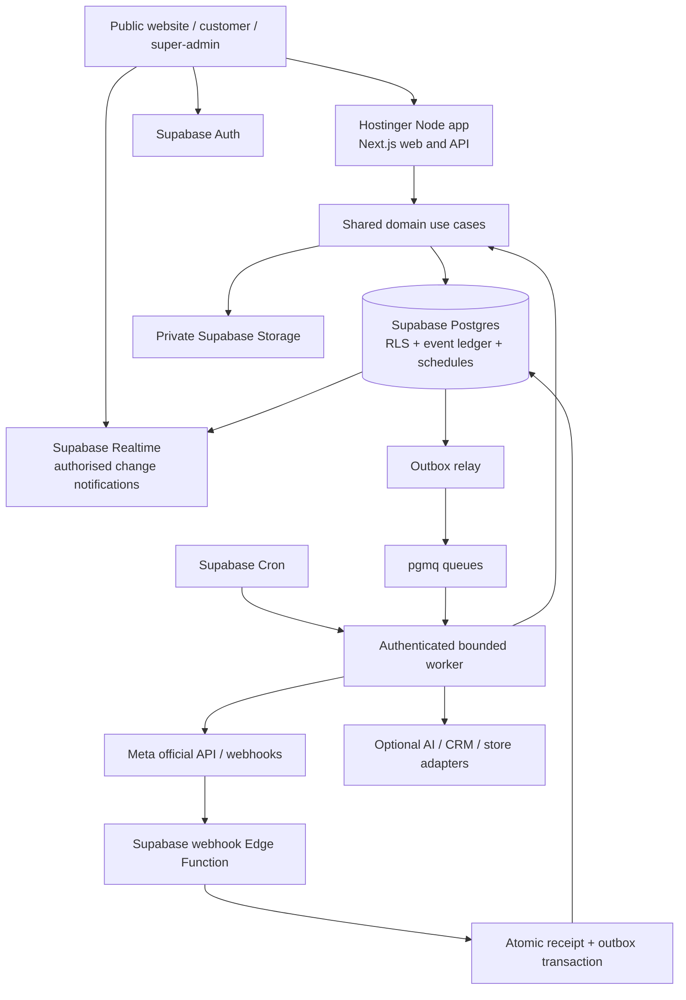
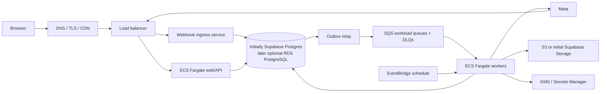

# 03 — System architecture

## Architectural choice

Use a **modular monolith with durable asynchronous jobs**. One repository, one shared domain implementation, and a few deployment entrypoints keep the pilot affordable. Separate runtime entrypoints are not automatically microservices. Extract a service later only when load, ownership or failure isolation requires it.

## Selected pilot stack

| Layer | Decision | Rationale / boundary |
| --- | --- | --- |
| Website + dashboards + HTTP API | Next.js + React + TypeScript | One Hostinger Node app; server routes call domain use cases |
| UI | Tailwind + accessible component primitives | Theme chosen after inspiration; domain-independent |
| Database | Supabase managed PostgreSQL | Tenant data, audit, scheduler and event ledger |
| Identity | Supabase Auth | Email login, invitations, reset, admin MFA |
| Browser updates | Supabase Realtime | Tenant-authorised projections; resync from DB after reconnect |
| Files | Supabase private Storage | Signed links and tenant-specific access policies |
| Webhook entrypoint | Supabase Edge Function | Hostinger-independent public provider callback |
| Queue | Supabase Queues / `pgmq` | Durable pilot queue; use behind a broker port |
| Job execution | Bounded Supabase Edge Function batches | No dependency on Hostinger daemon lifetime |
| Scheduling | Postgres due-job ledger + Supabase Cron | Persisted timing, guarded claiming and worker wake-ups |
| Database access | SQL migrations; narrow RPC / repository adapters | RLS and transaction behaviour visible to reviewers |
| AI | Provider port; disabled until evaluated | No model/API commitment before cost and quality tests |
| Tests | TypeScript unit tests, DB integration tests, browser tests | Verify failure behaviour and customer journeys |
| Dependency management | npm workspaces + one lockfile | Familiar GitHub/hosting build path; pin versions at implementation |

Choose a currently supported patched Node LTS and compatible framework versions during M0. The design does not freeze old versions found in sample apps. Hostinger's supported build settings must match the actual workspace scripts.

Supabase Queues provides durable Postgres-backed queuing. Its consumer visibility semantics do not make external sends exactly once. [Supabase Queues](https://supabase.com/docs/guides/queues)

Edge Functions have finite memory, CPU and wall-clock budgets. The proposed 20-second worker budget deliberately stays below their documented ceilings; large imports, indexing and audio processing require chunking or another worker runtime. [Supabase function limits](https://supabase.com/docs/guides/functions/limits)

## Pilot topology



The database outbox is authoritative if the queue relay is delayed. Cron wakes bounded workers; durable jobs survive invocation failure. An event-driven wake-up may reduce latency, but it is only an optimisation. Use a private cron invocation with a secret held in Vault rather than credentials inside plain scheduling SQL. [Scheduled Edge Functions](https://supabase.com/docs/guides/functions/schedule-functions)

Supabase Cron can schedule database and HTTP tasks; it is not an unlimited compute service. Start with a small number of jobs, stagger work, and monitor overlaps. [Supabase Cron](https://supabase.com/docs/guides/cron)

## Planned repository layout

This is a target tree, not a set of empty directories to create now.

```text
passion-fruit/
  apps/
    web/                         # Next.js marketing, tenant and admin entrypoints
      src/app/(marketing)/
      src/app/(auth)/
      src/app/(tenant)/
      src/app/(platform)/
      src/app/api/v1/
      src/features/              # UI feature folders
      src/server/                # server composition, session, adapters
    worker/                      # Node worker entrypoint when AWS migration begins
  packages/
    domain/                      # Pure business rules and use cases
      src/identity/
      src/tenancy/
      src/entitlements/
      src/channels/
      src/messaging/
      src/inbox/
      src/contacts/
      src/campaigns/
      src/scheduling/
      src/workflows/
      src/agents/
      src/knowledge/
      src/integrations/
      src/analytics/
      src/billing/               # Create only with billing milestone
    adapters/                    # Supabase, pgmq, Meta, storage, AI implementations
    contracts/                   # Versioned HTTP/event DTO schemas
    sdk/                         # Generated/typed client once v1 API exists
    ui/                          # Only genuinely shared components
  supabase/
    migrations/                  # Schema, indexes, policies, grants, functions
    functions/meta-webhook/      # Small Deno ingress/composition layer
    functions/job-worker/        # Bounded worker/composition layer
    tests/                       # RLS, transaction and SQL behaviour
  tests/e2e/
  docs/
  .github/workflows/
  package.json
  package-lock.json
```

Domain code uses portable TypeScript with injected ports; no Node-only filesystem or runtime globals. Node and Deno adapters are separate where necessary. CI must build the domain for both actual runtimes; importing a TypeScript file successfully locally is not portability proof. UI modules do not query another module's tables directly.

## Module boundaries

| Module | Owns | Communicates through |
| --- | --- | --- |
| Identity / tenancy | Membership, platform roles, tenant status | Auth context and provisioning use cases |
| Entitlements | Registry, grants, quotas, reservations | Authorisation decision and meter commands |
| Channels | Provider account mapping, capabilities, encrypted credential references | Channel resolver / provider adapter |
| Messaging | Outbound intents, attempts, status ledger, inbound normalization | Commands/events and message repository |
| Inbox | Conversations, assignments, notes, human/bot ownership | Conversation commands and version checks |
| Contacts / CRM | Identity, consent evidence, suppression, tags, leads | Contact/segment services |
| Campaigns | Immutable audience and logical recipient operations | Messaging enqueue command |
| Scheduling | Durable due records, recurrence and cancellation | Job claims and versioned commands |
| Workflows / agents | Graph versions, runs, knowledge/tool policies | Messaging and integration ports |
| Integrations | OAuth/state, sync cursors, external identifiers | Signed adapters, integration job events |
| Analytics / billing | Projections, metric definitions, usage ledger | Append-only domain facts; no parallel send logic |

Public HTTP entrypoints validate DTOs, authenticate, authorise and invoke use cases. They do not embed business workflows in route files. An integration cannot bypass messaging policy by directly sending through Meta.

## Ports that make migration possible

`MessageProvider`, `QueueBroker`, `SchedulerRepository`, `ObjectStore`, `CredentialStore`, `IdentityProvider`, `KnowledgeIndex`, `AIProvider`, `CRMConnector`, `CommerceConnector`, `Telemetry` and module repositories have explicit interfaces. Do not implement unused alternatives initially.

The queue carries job IDs and a schema version, not full customer messages or access tokens. The database stores authoritative intent and state. AWS SQS can replace pgmq without moving correctness into broker-specific features. Standard SQS can redeliver messages, so consumers remain idempotent. [AWS SQS delivery semantics](https://docs.aws.amazon.com/AWSSimpleQueueService/latest/SQSDeveloperGuide/standard-queues-at-least-once-delivery.html)

## AWS target



Fargate is the recommended container runtime when independent worker scaling becomes useful. It removes the need to manage individual worker hosts, but still needs deployment, networking and monitoring configuration. [AWS Fargate](https://docs.aws.amazon.com/AmazonECS/latest/developerguide/AWS_Fargate.html)

Retain Supabase Auth, Storage, Realtime and Postgres initially if they still meet needs. Moving Postgres to RDS does not automatically migrate these services or their policies. A full replacement requires separate adapters, identity/session migration and customer acceptance. Migration details are in document 09.

## Capacity design

High volume is a growth architecture requirement, not a pilot hosting claim. Separate ingress from expensive processing; apply bounded batch sizes; index tenant/message/channel lookup paths; use workload queues for inbound, outbound, AI and integrations; preserve tenant fairness; and scale based on oldest-job age plus processing latency. Partition ledgers only after measurements show benefit. Avoid Kafka, Kubernetes and Redis as initial prerequisites.
