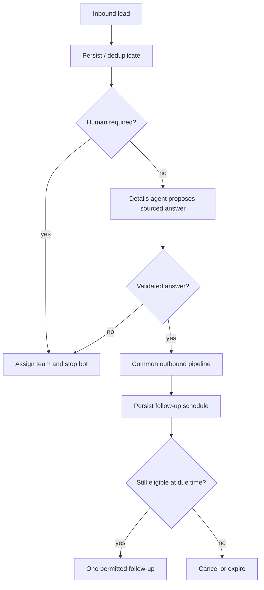

# 07 — AI agents, no-code workflows and integrations

## AI execution model

Use a deterministic conversation controller to select one active agent role at a time. Agents are configurations of a shared runtime, not separate autonomous processes that independently send WhatsApp messages. Tools produce proposed actions; the application validates and executes them. AI does not have raw SQL, unrestricted network access or provider secrets.

| Role | Purpose | Allowed actions | Mandatory stop / handoff |
| --- | --- | --- | --- |
| Details agent | Answer product/service questions | Retrieve published tenant facts, propose reply | Missing/contradictory information |
| Qualification agent | Capture lead need and permitted details | Validated CRM field proposals | Sensitive/requested human support |
| Follow-up agent | Compose next eligible follow-up | Propose scheduled action with limits | Reply, opt-out, human ownership or expiry |
| Support agent | FAQs and order/support routing | Retrieve permitted order context, create task | Complaint, refund, uncertainty, policy exception |
| Summary assistant | Summarise for a human | Internal summary only | No external send authority |

The pilot supports two configured roles using the same controller. Fully configurable multi-agent routing expands later. Persist selected role, configuration version, knowledge version, budget, ownership generation and trace for each run.

## Knowledge and retrieval

Knowledge belongs to the tenant and can have narrower team/resource permissions. Source ingestion validates file size/type, extracts text in bounded jobs, chunks and indexes with tenant metadata. Retrieval queries filter tenant and permissions **inside the query**, before ranking/results reach a model. Never retrieve globally then filter after model generation.

Use structured authoritative sources for price, availability, booking rules and order status. Documents and inbound user messages are untrusted content; instructions inside them cannot change tool permissions or system policies. Store references supporting answers; return a human handoff when sources are missing rather than inventing an answer. Deleting or replacing a source invalidates chunks and pending cached answers.

Knowledge may use Postgres full-text initially; add pgvector after retrieval evaluation demonstrates value. Do not run local GPU models on Cloud Startup. A hosted provider is a practical pilot option but introduces metered costs; provider/model selection remains open. Self-hosted/open-source AI requires its own compute and operations budget.

## Guarded reply lifecycle

1. Inbound event selects deterministic route and claims current conversation generation.
2. Retrieve only authorised knowledge and recent relevant history.
3. Reserve token/cost allowance; stop when budget is exhausted.
4. Call provider with deadline and structured response schema.
5. Validate output, facts, tool arguments, language and reply length; apply escalation rules.
6. Persist proposal and evidence. Suggestion mode displays it to a human; automatic mode passes it to the standard send pipeline.
7. Dispatch rechecks current conversation generation, grants, channel status and messaging policy.
8. Record actual tokens/cost/latency/outcome; reconcile reservations.

AI cannot guarantee factual correctness or infer confidence from an invented percentage. Use evaluation-backed rules: source coverage, unsupported facts, tool validity and intent-specific thresholds. Pilot auto-send is limited to approved FAQ/detail cases after suggestion-mode review. Lead follow-up uses durable schedules rather than an AI process sleeping.

## No-code workflow engine

Builder emits versioned JSON, validated on draft save and publish. Node types begin with `trigger`, `condition`, `send_template`, `send_text`, `assign_human`, `set_tag`, `update_contact_field`, `wait_until`, `ai_step`, `end`. Later add connector operations and Meta Flow send nodes.

Triggers: inbound message, tagged lead, appointment created, external order/cart event, scheduled occurrence or explicit admin-approved action. Conditions use a finite typed expression grammar. No user JavaScript, Python, shell, raw SQL or arbitrary URL execution in the builder.

Publish validates start/end reachability, parameter schemas, required feature grants, template/channel references, node limits, wait bounds and cycles. Initial engine uses acyclic graphs; later bounded loops require explicit iteration/cost limits. Disabling a dependent feature prevents new runs and blocks affected pending steps.

Published versions are immutable. Runs pin a version; editing drafts does not change running customers' behaviour. Each run stores trigger identity, current step, input references, iteration/chain budget and checkpoint. Side-effect steps have unique logical keys `(run_id, node_id, occurrence)`. `wait` persists a schedule and exits; no long-lived HTTP function waits. A crash resumes from the last checkpoint without repeating completed side effects.

A failed step can stop, retry safely or route to a configured error branch. Show the actual execution path in the UI with redacted inputs and errors. Replay for debugging runs in simulation mode by default; a replay must not accidentally resend historic messages. Recursive triggers share causation chains and maximum chain depth.

## Example lead workflow

Default follow-up proposal: one follow-up per lead unless owner configures an evaluated higher cap; quiet hours and expiry; cancel on reply/opt-out/handoff. This avoids competing agents flooding the same contact.

## Human handoff

Conversation modes: `human`, `bot`, `paused`, with role/agent selection and a versioned generation. Human takeover cancels unstarted AI and workflow send jobs, records reason, assigns an owner and pauses bot until explicit release or configured policy. User requests for human support route promptly. Failure of AI/provider/knowledge returns a useful human task; no infinite “please wait” loop.

## CRM and commerce integration framework

Build one connector at a time after owner chooses actual pilot CRM/store. Candidate integrations include WooCommerce or Shopify and a CRM such as HubSpot; these are examples, not confirmed account availability or implemented connectors. Each implementation requires official API/security review and its own fixtures.

Framework requirements: tenant OAuth/state binding, encrypted credentials, signature verification on inbound hooks, provider-event dedupe, mapped external IDs, bounded retries, rate limits, sync cursor checkpoints, periodic reconciliation and loop prevention. Define authoritative source per field: store owns order/payment state; Passion Fruit owns inbox assignment; CRM contact fields have explicit conflict rules. Do not overwrite new external changes with stale snapshots.

Cart abandonment is not proof of marketing opt-in. Order events map to permitted messaging actions after eligibility checks. A payment link is not a payment confirmation; confirmation comes from signed provider events. Catalogue and payment/calling capabilities are region/provider/account dependent and must not be advertised before validated.

## Voice roadmap

Separate recorded audio sending, speech-to-text, synthetic voice and voice calling. They require different capabilities and providers. Initial scope is secure audio upload/playback and verified official message-format support; do not promise a particular “voice note” appearance, codec, playback receipt or template support until tested with the selected Graph version.

Using a real person's voice requires that person's explicit documented authorisation, permitted purpose, revocation and provider compliance. Interpret the brief as an authorised business/brand voice feature, not automatic cloning of customer voice messages. Voice synthesis/transcoding runs outside a CPU-limited Edge batch if necessary; record cost and source provenance. Calling is a separate future review.
